# Mobile Car Wash Application — Master Plan

## Vision

A mobile-responsive web application for a mobile car wash business that allows customers to book one-time washes or subscribe to monthly plans. Built franchise-ready from day one using E-Myth Revisited principles. Solo operator at launch, architected for multi-crew scaling.

---

## System Architecture

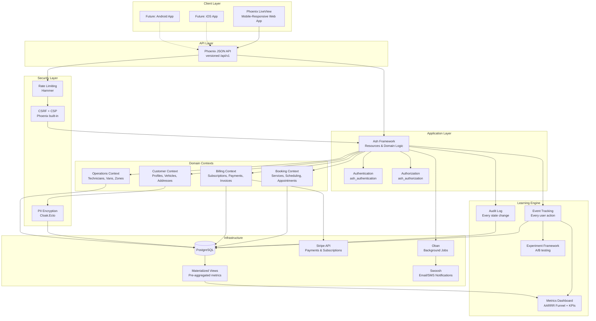

---

## Tech Stack

| Layer | Technology | Why |
|-------|-----------|-----|
| Language | Elixir | Concurrency, fault tolerance, real-time via Phoenix |
| Web Framework | Phoenix 1.7+ / LiveView | Rich interactive UI without JS framework overhead |
| Domain Framework | Ash Framework | Declarative resources, built-in auth, API generation |
| Database | PostgreSQL | Robust, Ash-native support |
| Payments | **Stripe** | Best subscription/recurring billing APIs, strong Elixir library (`stripity_stripe`), handles SCA/PCI compliance |
| Background Jobs | Oban | Persistent job processing (reminders, billing, notifications) |
| Email/SMS | Swoosh + provider TBD | Confirmation emails, appointment reminders |
| Testing (BDD) | Wallaby + ExUnit | Browser-based BDD tests + unit/integration TDD |
| Testing (TDD) | ExUnit + Ash testing helpers | Resource-level and context-level tests |
| CSS | Tailwind CSS | Ships with Phoenix, mobile-first responsive |
| Deployment | Fly.io or self-hosted | Elixir-friendly, easy scaling |

---

## Domain Model

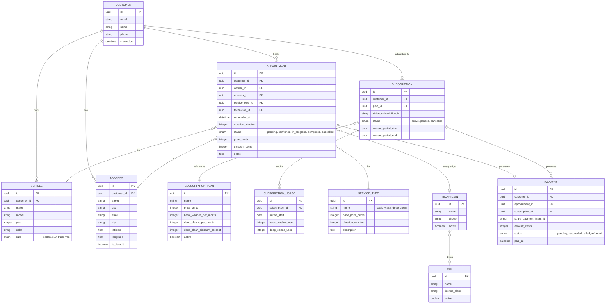

---

## Subscription Plans — Business Logic

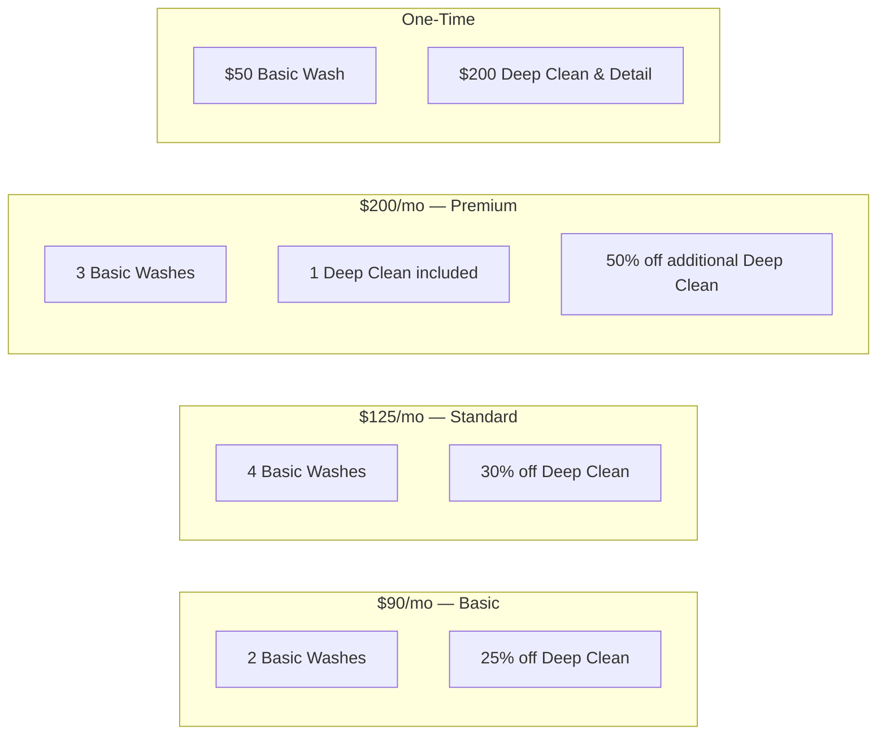

---

## Customer Booking Flow

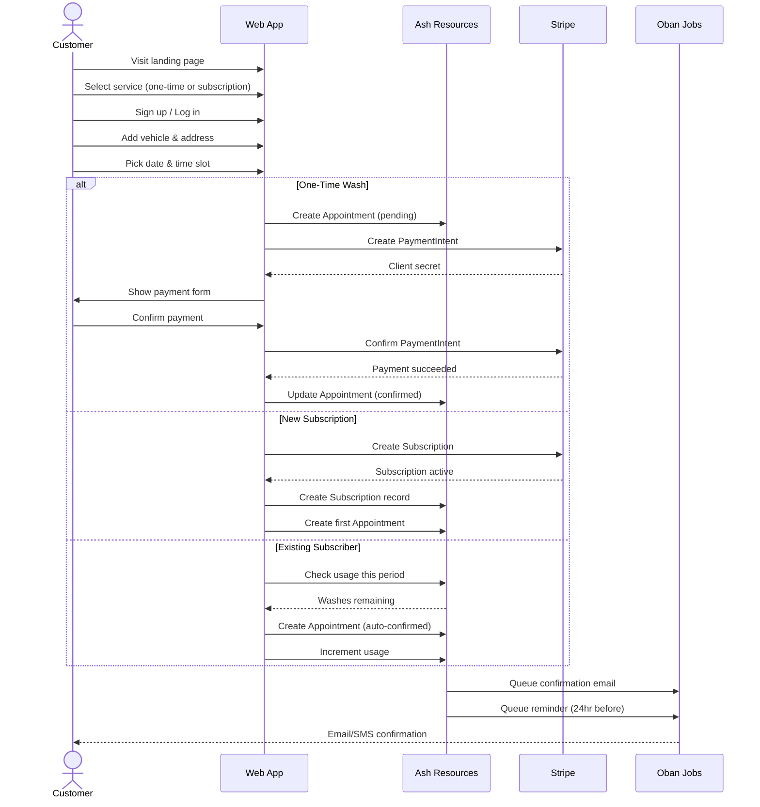

---

## MVP Phased Delivery

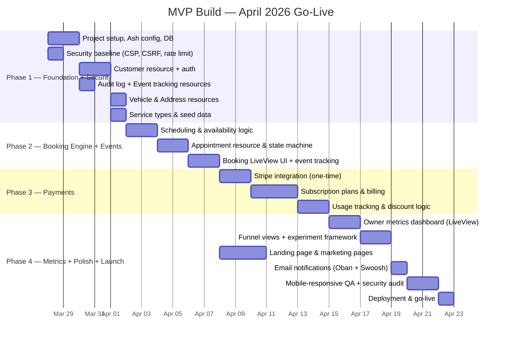

---

## Project Structure

```
mobile_car_wash/
├── lib/
│   ├── mobile_car_wash/
│   │   ├── accounts/           # Customer auth & profiles
│   │   │   ├── customer.ex     # Ash Resource
│   │   │   ├── token.ex        # Auth tokens
│   │   │   └── accounts.ex     # Ash Domain
│   │   ├── fleet/              # Vehicles, addresses
│   │   │   ├── vehicle.ex
│   │   │   ├── address.ex
│   │   │   └── fleet.ex        # Ash Domain
│   │   ├── scheduling/         # Appointments, availability
│   │   │   ├── appointment.ex
│   │   │   ├── service_type.ex
│   │   │   ├── time_slot.ex
│   │   │   └── scheduling.ex   # Ash Domain
│   │   ├── billing/            # Payments, subscriptions
│   │   │   ├── subscription_plan.ex
│   │   │   ├── subscription.ex
│   │   │   ├── subscription_usage.ex
│   │   │   ├── payment.ex
│   │   │   ├── stripe_client.ex
│   │   │   └── billing.ex      # Ash Domain
│   │   ├── analytics/          # Validated learning engine
│   │   │   ├── event.ex        # Ash Resource — all user events
│   │   │   ├── experiment.ex   # A/B test definitions
│   │   │   ├── experiment_assignment.ex
│   │   │   ├── funnel.ex       # Funnel calculation queries
│   │   │   ├── cohort.ex       # Cohort analysis queries
│   │   │   └── analytics.ex    # Ash Domain
│   │   ├── audit/              # Security audit trail
│   │   │   ├── audit_log.ex    # Ash Resource — all state changes
│   │   │   └── audit.ex        # Ash Domain
│   │   └── operations/         # Technicians, vans (Phase 2+)
│   │       ├── technician.ex
│   │       ├── van.ex
│   │       └── operations.ex   # Ash Domain
│   ├── mobile_car_wash_web/
│   │   ├── live/
│   │   │   ├── landing_live.ex
│   │   │   ├── booking_live.ex
│   │   │   ├── dashboard_live.ex
│   │   │   ├── subscription_live.ex
│   │   │   ├── admin/
│   │   │   │   ├── metrics_live.ex      # Owner dashboard — KPIs at a glance
│   │   │   │   ├── funnel_live.ex       # AARRR funnel visualization
│   │   │   │   ├── experiments_live.ex  # A/B test management
│   │   │   │   └── audit_live.ex        # Security audit log viewer
│   │   │   └── components/
│   │   ├── controllers/
│   │   │   └── api/v1/         # JSON API for future native apps
│   │   └── router.ex
│   └── mobile_car_wash.ex
├── test/
│   ├── mobile_car_wash/
│   │   ├── accounts_test.exs
│   │   ├── scheduling_test.exs
│   │   └── billing_test.exs
│   ├── mobile_car_wash_web/
│   │   └── live/
│   │       └── booking_live_test.exs
│   └── features/               # BDD feature tests (Wallaby)
│       ├── customer_signup_test.exs
│       ├── book_wash_test.exs
│       └── subscribe_test.exs
├── priv/
│   ├── repo/migrations/
│   └── static/
├── config/
├── mix.exs
└── .formatter.exs
```

---

## BDD/TDD Approach

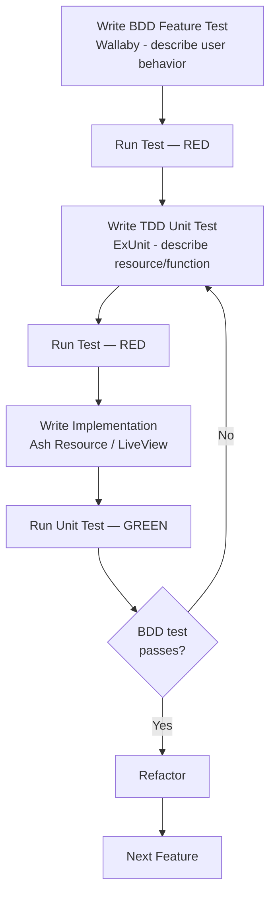

**Example BDD cycle for booking:**

1. **BDD (outer loop):** Write a Wallaby test — "Customer visits site, selects basic wash, picks a time, pays, and sees confirmation"
2. **TDD (inner loop):** Write ExUnit tests for `Appointment.create/1`, `Billing.charge_one_time/2`, etc.
3. **Implement** Ash resources and LiveView to make tests green
4. **Refactor** and repeat

---

## Future Phases (Post-MVP)

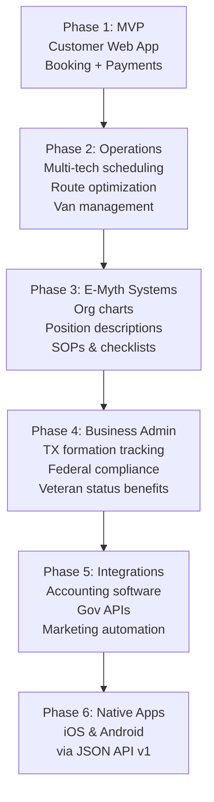

---

## Security Architecture

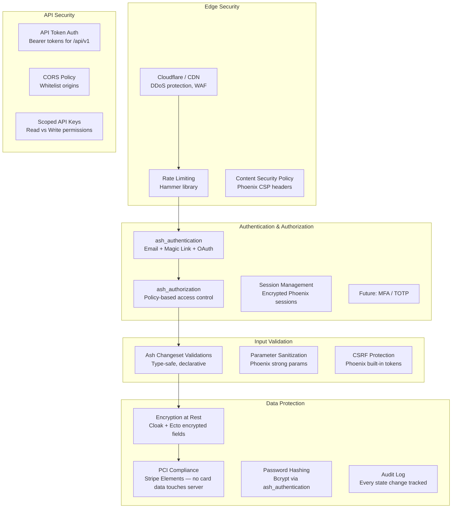

### Security Layers in Detail

| Layer | Implementation | Threat Mitigated |
|-------|---------------|-----------------|
| **DDoS / WAF** | Cloudflare free tier | Volumetric attacks, bot traffic |
| **Rate Limiting** | `Hammer` library — per-IP and per-user | Brute force login, API abuse |
| **CSRF** | Phoenix built-in CSRF tokens on all forms | Cross-site request forgery |
| **CSP Headers** | Strict Content-Security-Policy | XSS, script injection |
| **Authentication** | `ash_authentication` — email/password + magic link | Unauthorized access |
| **Authorization** | `ash_authorization` — policy per action per resource | Privilege escalation |
| **PCI Compliance** | Stripe Elements (client-side) — **zero card data on our server** | Card data breach |
| **Encryption at Rest** | `Cloak` + `Cloak.Ecto` for PII fields (email, phone, address) | Database breach |
| **Audit Logging** | Custom Ash change tracker — who, what, when, from where | Forensics, compliance |
| **Input Validation** | Ash changeset validations — type-safe, declarative | SQL injection, malformed data |
| **Session Security** | Encrypted cookies, short TTL, secure + httponly flags | Session hijacking |
| **API Auth** | Bearer token + scoped permissions | API abuse, data exfiltration |
| **Dependency Scanning** | `mix_audit` + `sobelow` in CI | Known vulnerabilities |

### Audit Log Schema

Every meaningful action is recorded — this feeds both security forensics AND the validated learning metrics:

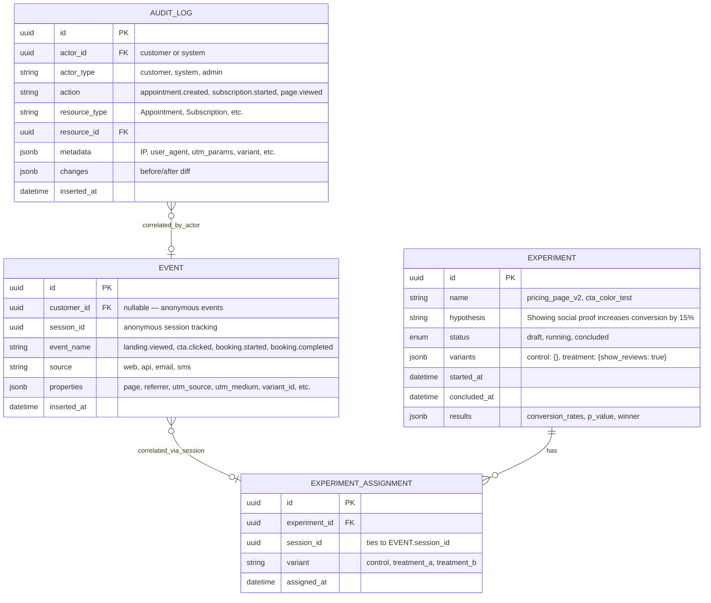

---

## Validated Learning & Actionable Metrics

This is the **Build → Measure → Learn** engine. Every feature ships with a hypothesis and a metric that tells us whether to **persevere, pivot, or kill**.

### The Innovation Accounting Framework

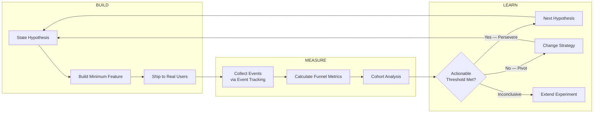

### The Metrics Dashboard — What You See at a Glance

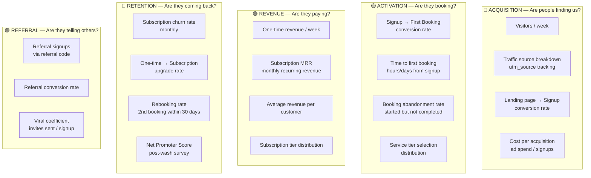

### Pirate Metrics (AARRR) — Mapped to Our Funnel

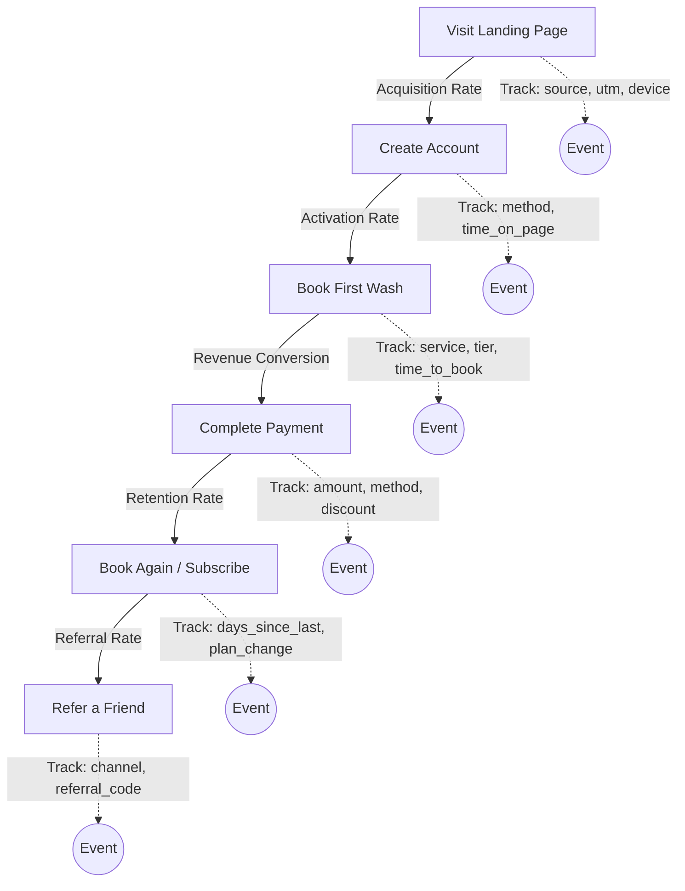

### Key Pivot Signals — When to Change Course

| Signal | Metric | Threshold | Action |
|--------|--------|-----------|--------|
| **Nobody's coming** | Weekly visitors | < 50 after 2 weeks marketing | Pivot marketing channel |
| **Coming but not signing up** | Visit → Signup rate | < 5% | Pivot landing page, value prop, or pricing display |
| **Signing up but not booking** | Signup → Booking rate | < 30% | Pivot UX, reduce friction, add urgency |
| **Booking but abandoning** | Booking abandonment | > 60% | Pivot payment flow, add trust signals |
| **Not coming back** | 30-day rebooking rate | < 20% for one-time | Pivot to subscription-first, improve service quality |
| **Subscriptions churning** | Monthly churn | > 15% | Pivot pricing tiers, add value, survey churned users |
| **Wrong tier chosen** | Tier distribution | > 70% on cheapest | Pivot pricing anchoring, reorder tiers |
| **One-time customers won't upgrade** | One-time → Sub rate | < 10% after 3 months | Pivot subscription value prop, trial period |

### How Events Flow Through the System

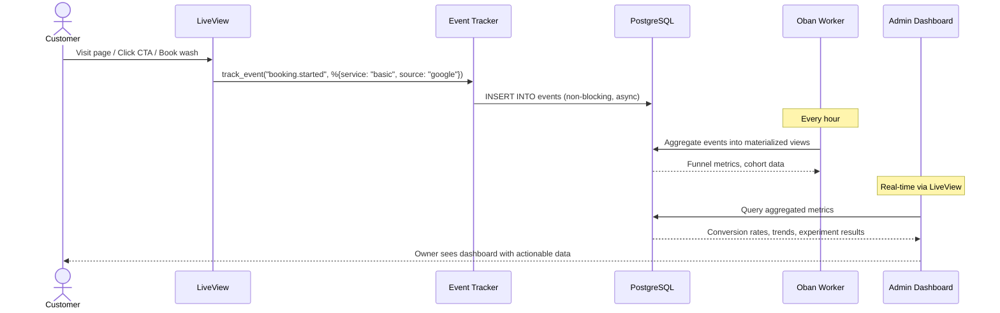

### Experiment Framework — Built-In A/B Testing

Every feature can run as an experiment:

```elixir
# In any LiveView — assign a variant
def mount(_params, session, socket) do
  variant = Experiments.assign(session_id, "pricing_page_layout")
  # variant is :control or :treatment_a

  {:ok, assign(socket, variant: variant)}
end

# In template — render based on variant
# <%= if @variant == :treatment_a do %>
#   <PricingGridWithSocialProof />
# <% else %>
#   <PricingGridControl />
# <% end %>

# Track conversion tied to variant
def handle_event("book_wash", params, socket) do
  Events.track(socket, "booking.completed", %{variant: socket.assigns.variant})
end
```

### The Owner Dashboard — Your Daily Decision Tool

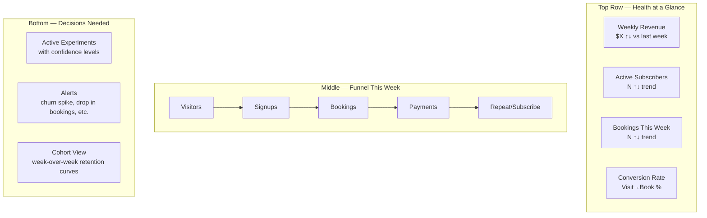

### What Gets Tracked from Day One (MVP)

| Event | Properties | Why |
|-------|-----------|-----|
| `page.viewed` | path, referrer, utm_source, utm_medium, device | Know where customers come from |
| `signup.completed` | method (email/google), referral_code | Track acquisition channel effectiveness |
| `booking.started` | service_type, is_subscriber | Measure intent |
| `booking.abandoned` | step (vehicle, address, time, payment), reason | Find friction points |
| `booking.completed` | service_type, price, discount, time_to_complete | Measure activation |
| `payment.succeeded` | amount, type (one_time/subscription), plan_id | Revenue tracking |
| `payment.failed` | error_reason, retry_count | Fix payment friction |
| `subscription.started` | plan_id, previous_one_time_count | Track upgrade path |
| `subscription.cancelled` | plan_id, reason, months_active, total_spent | Understand churn |
| `subscription.usage` | washes_used, washes_remaining, days_remaining | Predict churn risk |
| `review.submitted` | rating, nps_score, appointment_id | Service quality signal |
| `referral.sent` | channel (email/sms/link) | Viral growth tracking |
| `referral.converted` | referrer_id, plan_selected | Referral program ROI |

---

## Updated Tech Stack (additions)

| Layer | Technology | Why |
|-------|-----------|-----|
| Rate Limiting | Hammer | Configurable per-route rate limiting |
| Encryption | Cloak + Cloak.Ecto | Encrypt PII at rest (email, phone, address) |
| Security Scanning | Sobelow + MixAudit | Static analysis + dependency vulnerability checks |
| Event Tracking | Custom Ash resource + PostgreSQL | First-party analytics — no third-party data leakage |
| Materialized Views | PostgreSQL | Pre-aggregated funnel metrics for fast dashboard queries |
| Admin Dashboard | Phoenix LiveView | Real-time metrics dashboard, same stack |

---

## Key Architectural Decisions

| Decision | Choice | Rationale |
|----------|--------|-----------|
| API-first | JSON API alongside LiveView | Native apps later without rewriting business logic |
| Ash Domains | Separate contexts (Accounts, Scheduling, Billing, Operations) | Clean boundaries, testable, franchise-ready |
| Stripe | Over Square | Superior subscription management, webhooks, Elixir library maturity |
| Oban | For background jobs | Persistent, PostgreSQL-backed, perfect for reminders & billing cycles |
| Multi-tenant ready | Technician/Van models from day one | Schema supports multiple operators even though MVP is single |
| Subscription usage tracking | Separate table per billing period | Clean audit trail, prevents over-usage, easy reporting |

---

## What's Next

Ready to start **Phase 1 — Foundation**:
1. Initialize the Phoenix/Ash project
2. Set up the database schema
3. Write our first BDD test (customer signup)
4. Build from there iteratively

Shall we begin?
